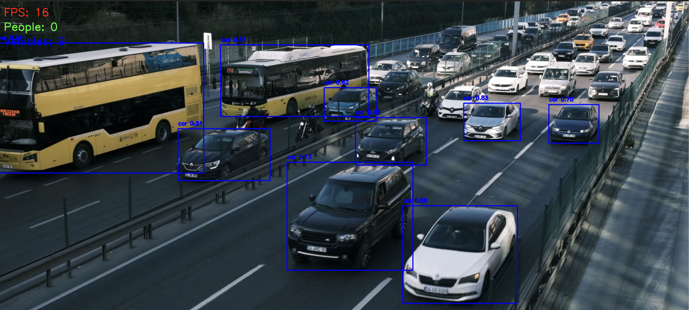

# Real-Time Vehicle and Pedestrian Detection System

## Overview

This project is a real-time computer vision system built using YOLOv8 and OpenCV.

It detects vehicles and pedestrians from video streams, draws bounding boxes with confidence scores, tracks object counts, and displays FPS metrics in real time.

The system can process webcam feeds or recorded traffic videos and save processed output videos.

---

## Features

- Real-time object detection
- Vehicle and pedestrian recognition
- Bounding boxes with confidence scores
- FPS monitoring
- People and vehicle counting
- Video file processing
- Output video saving

---

## Tech Stack

- Python
- OpenCV
- YOLOv8
- Ultralytics

---

## Project Structure

```text
vehicle-pedestrian-detection/
│
├── videos/
│   └── traffic.mp4
│
├── outputs/
│   └── output.avi
│
├── screenshots/
│   ├── detection1.png
│   └── detection2.png
│
├── main.py
├── requirements.txt
├── README.md
└── .gitignore
```

---

## Installation

Clone the repository:

```bash
git clone <your-repo-link>
cd vehicle-pedestrian-detection
```
Create a virtual environment:

```bash
python -m venv venv
```

Activate the virtual environment:

### macOS/Linux

```bash
source venv/bin/activate
```

### Windows

```bash
venv\Scripts\activate
```

Install dependencies:

```bash
pip install -r requirements.txt
```

---

## Usage

Add a traffic video inside the `videos/` folder.

Example:

```text
videos/traffic.mp4
```

Run the application:

```bash
python main.py
```

Press `q` to quit the application.

Processed output video will be saved inside:

```text
outputs/output.avi
```

---

## Future Improvements

- Traffic density estimation
- Lane-wise vehicle counting
- Speed estimation
- GPU acceleration
- Multi-camera support

---

## Sample Output

### Detection Example




---

## Author

Azfar
